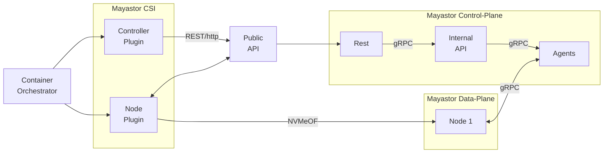

# CSI in Mayastor

CSI is a storage provider gRPC interface independent of storage vendor and
cloud environment. The reader should be familiar with CSI spec before reading this
document.

Basic workflow starting from registration is as follows:

1. csi-node-driver-registrar retrieves information about csi plugin (mayastor) using csi identity service.
1. csi-node-driver-registrar registers csi plugin with kubelet passing plugin's csi endpoint as parameter.
1. kubelet uses csi identity and node services to retrieve information about the plugin (including plugin's ID string).
1. kubelet creates a custom resource (CR) "csi node info" for the CSI plugin.
1. kubelet issues requests to publish/unpublish and stage/unstage volume to the CSI plugin when mounting the volume.

The registration of the storage nodes (i/o engines) with the control plane is handled
by a gRPC service which is independent from the CSI plugin.

 

