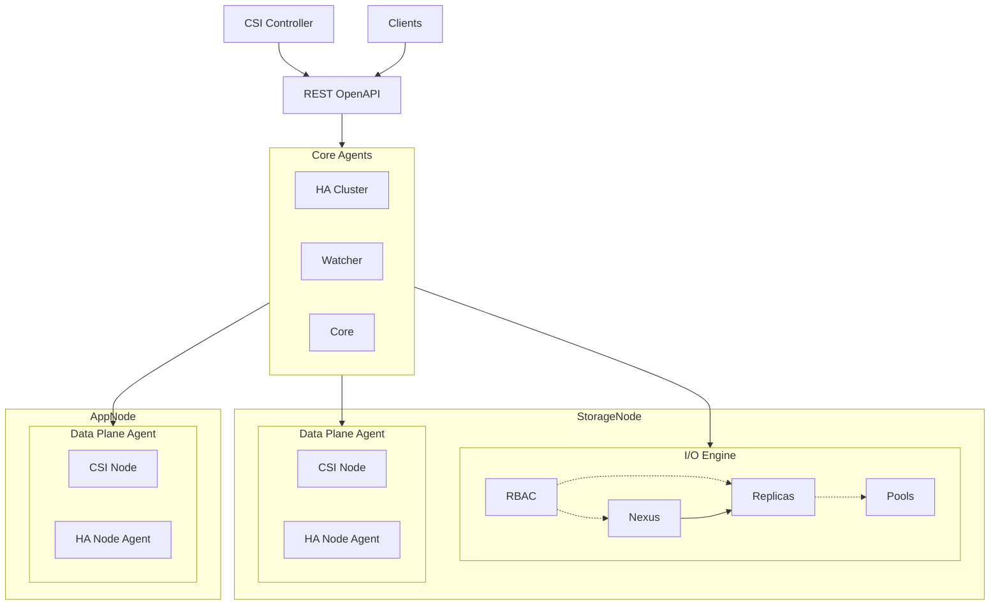
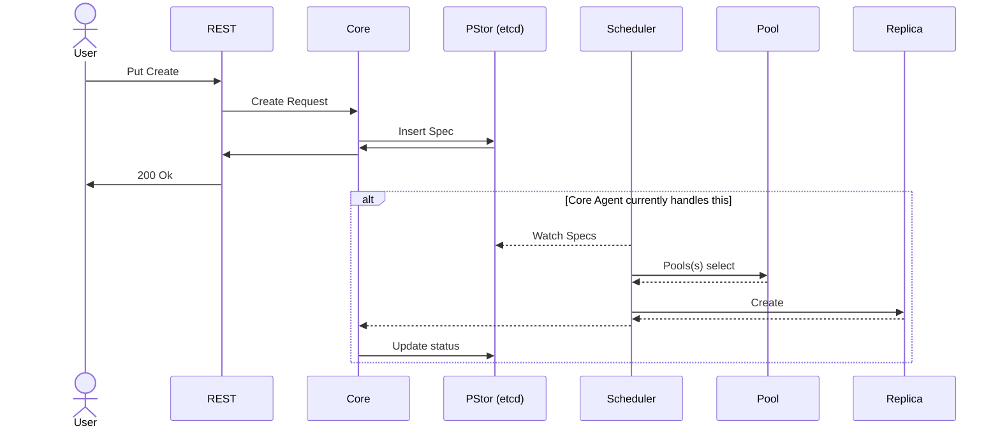
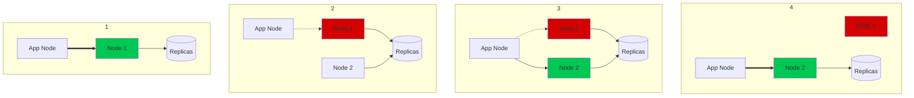

# Mayastor Control Plane

This provides a high-level design description of the control plane and its main components. It does not, for example, in detail, explain how a replica is retired.

## Background

The current control implementation started as _"just a [CSI] driver"_ that would provision volumes based on dynamic provisioning requests. The intent was to integrate this [CSI] driver within the `OpenEBS` control plane. As things progressed, it turned out that the control plane which we wanted to ingrate into had little control hooks to integrate into.

As a result, more complex functionality was introduced into [Mayastor itself (the data plane or io-engine)][Mayastor] and [MOAC] (the `CSI` driver). The increasing complexity of `MOAC`, with the implicit dependency on [K8s], made it apparent that we needed to split up this functionality into a Mayastor's own specific control plane.

At the same time, however, we figured out how far the stateless approach in [K8s] could be married with the inherently state-full world of [CAS].

We have concluded that we could not implement everything using the same – existing primitives directly. However, **we can leverage the same patterns**.

> "What [K8s] is to (stateless compute) we are to storage."

We can leverage the majority and implement the specifics elsewhere. A side effect of this is that it also means that it is not [K8s] dependent.

## High-level overview

The control plane is our locus of control. It is responsible for what happens to volumes as external events, planned or unexpected, occur. The control plane is extensible through agents. By default, several agents are provided and are part of the core services.

At a high level, the architecture is depicted below. Core and scheduler are so-called agents. Agents implement a function that varies from inserting new specifications to reconciling the desired state.



Default functionality provided by the control plane through several agents is:

- Provisioning of volumes according to specification (spec)

- Ensuring that as external events take place, the desired state (spec) is reconciled

- Recreates objects (pools, volumes, shares) after a restart of a data plane instance

- Provides an OpenAPI v3 REST service to allow for customization.

- Replica replacement

- Garbage collection

- CSI driver

- CRD operator for the interaction with k8s to create pools

<br>

### Some key points

- The control plane is designed to be scalable. That is to say; multiple control planes can operate on the same objects, where the control plane guarantees mutual exclusion. This is achieved by applying either distributed locks and/or leader elections. This currently is in a “should work” state. However, it is perhaps more practical to use namespacing where each control plane operates on a cluster-ID.

    > _**NOTE**_: this multi control-planes in a single cluster was left behind until further notice

- The control plane does not take part in the IO path, except when there is a dynamic reconfiguration event. If the control plane can not be accessed during such an event, the NVMe controller will remain frozen. The time we allow ourselves to retry operations during such an event is determined by the NVMe IO timeout and the controller loss time-out values.

- The control plane uses well-known, existing technologies as its building blocks. Most notable technologies applied:

  - etcd v3 and only version 3. 1 & 2 are not supported and will not get support

  - Written in Rust

  - gRPC

- We need at least three control nodes, where five is preferred.
The control plane is extensible by adding and removing agents where each agents complements the control plane in some way.
Example: the `HA *` agents allow for volume target failover by reconnecting the initiator to another replacement target.

<br>

## Persistent Store (KVstore for configuration data)

The Mayastor Control Plane requires a persistent store for storing information that it can use to make intelligent decisions. \
A key-value store has been selected as the appropriate type of store. \
[etcd] is very well known in the industry and provides the strong consistency models required for the control plane.

> _NOTE_: [etcd] is also a fundamental component of Kubernetes itself.

Throughout the control plane and data plane design, [etcd] is considered the source of truth.

Somethings to keep in mind when considering a persistent store implementation:

- **Performance**
  - Paxos/Raft consensus is inherently latency-sensitive. Moreover, the KV is memory-mapped, meaning that it suffers greatly from random IO.
  - As per their own docs, `etcd is designed to reliably store infrequently updated data…`
  - Fortunately, NVMe does not suffer from this; however, it’s not unlikely to assume some users will use rotational devices.
  - This limitation is acceptable for the control plane as, by design, we shouldn’t be storing information at anywhere near the limits of etcd.

- **Role-Based Access**
  - Who is allowed to list what? Due to the linear keyspace, this is important to consider by using prefixes.

- **Queries**
  - range-based are encouraged to do. There is no analogue of tables in KVs.

- **Notifications**
  - being notified of changes can be very useful to drive on-change reconciler events.

<br>

### Persistent Information

There are two categories of information that the control plane wishes to store:

1. Configuration
   - Specification for volumes, pools, etc
   - Policies for various scheduling logic
   - etc

2. System state
   - Volume states
   - Node states
   - Pool states
   - etc

#### System State

The control plane requires visibility of the state of the system in order to make autonomous decisions. For example, should a volume transition from a
healthy state to a degraded state, the control plane could inspect the state of its children and optionally (based on the policy) replace any that are
unhealthy.

Additionally, this state information would be useful for implementing an early warning system. If any resource (volume, node, pool) changed state, any
 etcd watchers would be notified. We could then potentially have a service which watches for state changes and notifies the upper layers (i.e. operators)
 that an error has occurred.

##### Note

Although initially planned, the system state is not currently persisted in [etcd] as the initial use-case for watchers could be fulfilled
by making use of an internal in-memory cache of objects, thus moving this problem further down the line. \
Even though etcd is only used for configuration we've had had users with etcd-related performance issues, which would will no doubt get even further
exacerbated if we also start placing the _**state in etcd**_. And so this will require very careful _**design**_ and _**consideration**_.

## Control plane agents

Agents form a specific function and concern themselves around a particular problem. There are several agents. The provisioning of a volume (say) involves
 pipelining between different agents. Each agent receives a request and response, and the response _MAY_ be the input for a subsequent request.

Agents can either be internal within the binary or be implemented as separate processes (containers).

<br>



<br>

> _**NOTE**_: As things stand today, the Core agent has taken the role of reconciler and scheduler.

<br>

## Reconcilers

Reconcilers implement the logic that drives the desired state to the actual state. In principle it's the same model as the operator framework provided by K8s, however as mentioned, it's tailored towards storage rather than stateless containers.

Currently, reconcilers are implemented for pools, replicas, nexuses, volumes, nodes and etcd. When a volume enters the degraded state, it is notified of this event and will reconcile as a result of it. The exact heuristics for picking a new replica is likely to be subjective to user preferences. As such, volume objects as stored with the control plane will have fields to control this behaviour.

```rust
#[async_trait::async_trait]
trait Reconciler {
    /// Run the reconcile logic for this resource.
    async fn reconcile(&mut self, context: &PollContext) -> PollResult;
}

#[async_trait::async_trait]
trait GarbageCollect {
    /// Run the `GarbageCollect` reconciler.
    /// The default implementation calls all garbage collection methods.
    async fn garbage_collect(&mut self, context: &PollContext) -> PollResult {
        squash_results(vec![
            self.disown_orphaned(context).await,
            self.disown_unused(context).await,
            self.destroy_deleting(context).await,
            self.destroy_orphaned(context).await,
            self.disown_invalid(context).await,
        ])
    }

    /// Destroy resources which are in the deleting phase.
    /// A resource goes into the deleting phase when we start to delete it and stay in this
    /// state until we successfully delete it.
    async fn destroy_deleting(&mut self, context: &PollContext) -> PollResult;

    /// Destroy resources which have been orphaned.
    /// A resource becomes orphaned when all its owners have disowned it and at that point
    /// it is no longer needed and may be destroyed.
    async fn destroy_orphaned(&mut self, context: &PollContext) -> PollResult;

    /// Disown resources which are no longer needed by their owners.
    async fn disown_unused(&mut self, context: &PollContext) -> PollResult;
    /// Disown resources whose owners are no longer in existence.
    /// This may happen as a result of a bug or manual edit of the persistent store (etcd).
    async fn disown_orphaned(&mut self, context: &PollContext) -> PollResult;
    /// Disown resources which have questionable existence, for example non reservable replicas.
    async fn disown_invalid(&mut self, context: &PollContext) -> PollResult;
    /// Reclaim unused capacity - for example an expanded but unused replica, which may
    /// happen as part of a failed volume expand operation.
    async fn reclaim_space(&mut self, _context: &PollContext) -> PollResult {
        PollResult::Ok(PollerState::Idle)
    }
}

#[async_trait::async_trait]
trait ReCreate {
    /// Recreate the state according to the specification.
    /// This is required when an io-engine instance crashes/restarts as it always starts with no
    /// state.
    /// This is because it's the control-plane's job to recreate the state since it has the
    /// overview of the whole system.
    async fn recreate_state(&mut self, context: &PollContext) -> PollResult;
}
```

## Data-Plane Agent

The data plane agent is the trojan horse. It runs on all nodes that want to consume storage provided by Mayastor.
It implements the CSI node specifications, but it will also offer the ability to register it as a service to the control plane.
This provides us with the ability to manipulate the storage topology on the node(s) to control, for example, various aspects of asymmetric namespace
access.

> _**NOTE**_: the data-plane agent doesn't exist as its own entity per se today, rather we have the csi-node plugin and the agent-ha-node which perform
> the role of what was to become the data-plane agent.

Consider the following scenario;

Given: A node(W) is connected to a mayastor NVMe controller on the node(1)

When: Node(1) needs to be taken out of service

Then: A new NVMe controller on node(2) that provides access to the same replicas needs to be added to the node(W)

This can only be achieved if the control plane can provision a new Nexus and then dynamically add a new path to the node.



The above picture depicts the sequence of steps. The steps are taken by the control plane but executed by the agent.
The value add is not the ANA feature itself, rather what you do with it.

## NATS & Fault management

We used to use NATS as a message bus within mayastor as a whole, but as since switched for gRPC for p2p communications. \
We will continue to use NATS for async notifications. Async in the sense that we send a message, but we do NOT wait for a reply. This mechanism does not
 do any form of "consensus," retries, and the likes. Information transported over NATS will typically be error telemetry that is used to diagnose problems. No work has started yet on this subject.

At a high level, error detectors are placed in code parts where makes sense; for example, consider the following:

```rust
fn handle_failure(
    &mut self,
    child: &dyn BlockDevice,
    status: IoCompletionStatus,
) {
    // We have experienced a failure on one of the child devices. We need to
    // ensure we do not submit more IOs to this child. We do not
    // need to tell other cores about this because
    // they will experience the same errors on their own channels, and
    // handle it on their own.
    //
    // We differentiate between errors in the submission and completion.
    // When we have a completion error, it typically means that the
    // child has lost the connection to the nexus. In order for
    // outstanding IO to complete, the IO's to that child must be aborted.
    // The abortion is implicit when removing the device.
    if matches!(
        status,
        IoCompletionStatus::NvmeError(
            NvmeCommandStatus::GenericCommandStatus(
                GenericStatusCode::InvalidOpcode
            )
        )
    ) {
        debug!(
            "Device {} experienced invalid opcode error: retiring skipped",
            child.device_name()
        );
        return;
    }
    let retry = matches!(
        status,
        IoCompletionStatus::NvmeError(
            NvmeCommandStatus::GenericCommandStatus(
                GenericStatusCode::AbortedSubmissionQueueDeleted
            )
        )
    );
}
```

In the above snippet, we do not handle any other errors other than aborted and silently ignore invalid opcodes. If, for example, we experience a class of
 error, we would emit an error report. Example classes are:

```text
err.io.nvme.media.* = {}
err.io.nvme.transport.* = {}
err.io.nexus.* = {}
```

Subscribes to these events will keep track of payloads and apply corrective actions. In its most simplistic form, it results in a model where one can
define a per class for error an action that needs to be taken. This error handling can be applied to IO but also agents.

The content of the event can vary, containing some general metadata fields, as well as event specific information.
Example of the event message capsule:

```protobuf
// Event Message
message EventMessage {
  // Event category
  EventCategory category = 1;
  // Event action
  EventAction action = 2;
  // Target id for the category against which action is performed
  string target = 3;
  // Event meta data
  EventMeta metadata = 4;
}
```

An up to date API of the event format can be fetched
 [here](https://github.com/openebs/mayastor-dependencies/blob/develop/apis/events/protobuf/v1/event.proto).

## Distributed Tracing

Tracing means different things at different levels. In this case, we are referring to tracing component boundary tracing.

Tracing is by default implemented using open telemetry and, by default, we have provided a subscriber for jaeger. From jaeger, the information can be
forwarded to, Elastic Search, Cassandra, Kafka, or whatever. In order to achieve full tracing support, all the gRPC requests and replies should add
HTTP headers such that we can easily tie them together in whatever tooling is used. This is standard practice but requires a significant amount of work.
The key reason is to ensure that all requests and responses pass along the headers, from REST to the scheduling pipeline.

We also need to support several types of transport and serialization mechanisms. For example, HTTP/1.1 REST requests to HTTP/2 gRCP request to
 a KV store operation to etcd. For this, we will use [Tower]. \
[Tower] provides a not-so-easy to use an abstraction of Request to Response mapping.

```rust
pub trait Service<Request> {
    /// Responses given by the service.
    type Response;
    /// Errors produced by the service.
    type Error;
    /// The future response value.
    type Future: Future<Output = Result<Self::Response, Self::Error>>;
    /// Returns `Poll::Ready(Ok(()))` when the service is able to process requests.
    fn poll_ready(&mut self, cx: &mut Context<'_>) -> Poll<Result<(), Self::Error>>;
    /// Implementations are permitted to panic if `call` is invoked without
    /// obtaining `Poll::Ready(Ok(()))` from `poll_ready`.
    fn call(&mut self, req: Request) -> Self::Future;
}
```

The provided services can then be layered with additional functions that add the required metadata as the service propagates through the system.

```rust
pub trait Layer<S> {
    /// The service for which we want to insert a new layer
    type Service;
    /// the implementation of the layer itself
    fn layer(&self, inner: S) -> Self::Service;
}
```

An example where a `REST` client sets the open tracing key/values on the request before it is sent:

```rust
let layer = TraceLayer::new_for_http().make_span_with(|request: &Request<Body>| {
    tracing::debug_span!(
        "HTTP",
        http.method = %request.method(),
        http.url = %request.uri(),
        http.status_code = tracing::field::Empty,
        // otel is a mandatory key/value
        otel.name = %format!("HTTP {}", request.method()),
        otel.kind = %SpanKind::Client,
        otel.status_code = tracing::field::Empty,
    )
})
```

[MOAC]: https://github.com/openebs/moac
[K8s]: https://kubernetes.io/
[CSI]: https://github.com/container-storage-interface/spec
[Mayastor]: ./mayastor.md
[CAS]: https://openebs.io/docs/2.12.x/concepts/cas
[Tower]: https://docs.rs/tower/latest/tower/
[etcd]: https://etcd.io/
