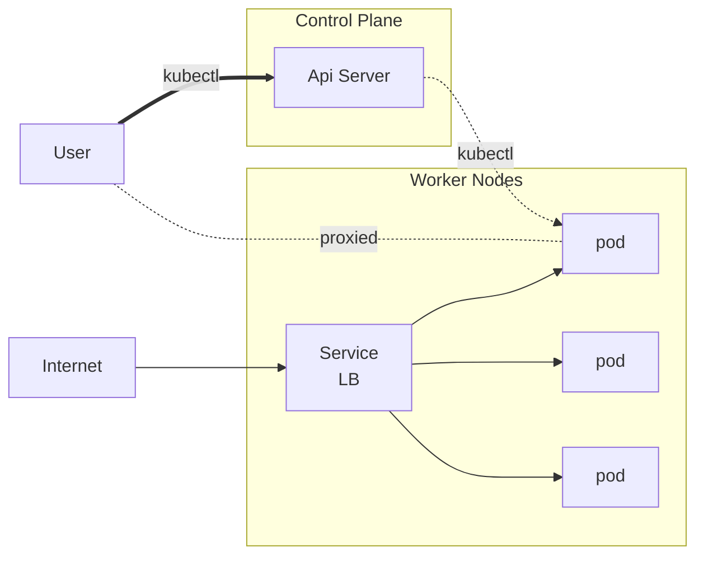

# Kubectl Plugin

## Overview

The kubectl-mayastor plugin follows the instructions outlined in
the [K8s] [official documentation](https://kubernetes.io/docs/tasks/extend-kubectl/kubectl-plugins/).

The name of the plugin binary dictates how it is used. From the documentation:
> For example, a plugin named `kubectl-foo` provides a command `kubectl foo`.

In our case the name of the binary is specified in the Cargo.toml file as `kubectl-mayastor`, therefore the command is
`kubectl mayastor`.

This document outlines all workflows and interactions between the plugin, the Mayastor control plane, and [K8s].
It provides a high-level overview of the plugin's general operation, the features it currently supports, and how
 these features integrate with the APIs.

This is the general flow of the request to generate an output from the plugin:

1. The flow starts with the CLI command, to be entered from console.

2. The respective command is supposed to hit the specific API endpoint dedicated for that purpose.

3. The API request is then forwarded to the Core Agent of the Control Plane.

4. Core Agent is responsible for the further propagation of the request based on its METHOD and purpose.

5. A GET request would not bring in any change in spec or state, it would get the needed information from registry and
   return it as a response to the request.

6. A PUT request would bring a change in the spec, and thus a synchronous action would be performed by mayastor.
   And updated spec and state would thus be returned as a response.

> ***NOTE***: A command might have targets other than the Core Agent, and it might not even be sent to the
> control-plane, example: could be sent to a K8s endpoint.

For a list of commands you can refer to the
docs [here](https://github.com/openebs/mayastor-extensions/blob/HEAD/k8s/plugin/README.md#usage).

## Command Line Interface

Some goals for the kubectl-mayastor plugin are:

- Provide an intuitive and user-friendly CLI for Mayastor.
- Function in similar ways to existing Kubernetes CLI tools.
- Support common Mayastor operations.

> **NOTE**: There are many principles for a good CLI. An interesting set of guidelines can be
> seen [here](https://clig.dev/) for example.

All the plugin commands are verb based, providing the user with a similar experience to
the official [kubectl](https://kubernetes.io/docs/reference/kubectl/#operations).

All the plugin commands and their arguments are defined using a very powerful cli library: [clap].
Some of these features are:

- define every command and their arguments in a type-safe way
- add default values for any argument
- custom long and short (single letter) argument names
- parse any argument with a powerful value parser
- add custom or well-defined possible values for an argument
- define conflicts between arguments
- define requirements between arguments
- flatten arguments for code encapsulation
- many more!

Each command can be output in either `tabled`, `JSON` or `YAML` format.
The `tabled` format is mainly useful for human usage where the others allow for integration with tools (ex: jq, yq) which
can capture, parse and filter.

Each command (and sub-commands) accepts the `--help | -h` argument, which documents the operation and the supported
arguments.

> **NOTE**: Not all commands and their arguments are as well documented as we'd wish, and any help improving this would
> be very welcome! \
> We can also consider auto-generating CLI documenting as markdown.

## Connection to the K8s Cluster

Exactly like the K8s kubectl, the kubectl-mayastor plugin runs on the users' system whereas mayastor is running in the K8s cluster.
A mechanism is then required in order to bridge this gap and allow the plugin to talk to the mayastor services running in the cluster.

The plugin currently supports 2 distinct modes:

1. Kube ApiServer Proxy
2. Port Forwarding

### Kube ApiServer Proxy

It's built-in to the K8s apiserver and allows a user outside of the cluster to connect via the apipserver to a clusterIp which would otherwise
be unreachable.
It proxies using HTTPS and it's capable of doing load balancing for service endpoints.

Above we highlight the difference between this approach and a load balancer service which exposes the IP externally.
You can try this out yourself with the [kubect-plugin][kubectl-proxy].

### Port Forwarding

K8s provides a [Port Forwarding](https://kubernetes.io/docs/tasks/access-application-cluster/port-forward-access-application-cluster/) to access
applications in a cluster.
This works by forwarding local ports to the cluster.

You can try this out yourself with the [kubect-plugin][kubectl-port-forward].

> *NOTE*: kubect port-forward is currently implemented for TCP ports only.

 

## Distribution

We distribute the plugin in similar ways to what's recommended by the kubectl plugin docs:

1. Krew \
   [Krew] offers a cross-platform way to package and distribute your plugins. This way, you use a single packaging format
   for all target platforms (Linux, Windows, macOS etc) and deliver updates to your users. \
   Krew also maintains a plugin index so that other people can discover your plugin and install it.
2. "Naked" binary packaged in a tarball \
   This is available as a [GitHub] release asset for the specific version: \
   `vX.Y.Z: https://github.com/openebs/mayastor/releases/download/v$X.$Y.$Z/kubectl-mayastor-$platform.tar.gz` \
   Example, you can get the x86_64 plugin for v2.7.3 can be
   retrieved [here](https://github.com/openebs/mayastor/releases/download/v2.7.3/kubectl-mayastor-x86_64-linux-musl.tar.gz).
3. Source code \
   You can download the source code for the released version and build it yourself. \
   You can check the build docs for reference [here](../../build-all.md#building).

## Supported Platforms

Although the mayastor installation is only officially supported for Linux x86_64 at the time of writing, the plugin
actually supports a wider range of platforms. \
This is because although most production K8s cluster are running Linux x86_64, users and admins may interact with the
clusters from a wider range of platforms.

- [x] Linux
  - [x] x86_64
  - [x] aarch64
- [x] MacOs
  - [x] x86_64
  - [x] aarch64
- [ ] Windows
  - [x] x86_64
  - [ ] aarch64

[K8s]: https://kubernetes.io/

[clap]: https://docs.rs/clap/latest/clap/

[GitHub]: https://github.com/openebs/mayastor

[Krew]: https://krew.sigs.k8s.io/

[kubectl-proxy]: https://kubernetes.io/docs/reference/generated/kubectl/kubectl-commands#proxy

[kubectl-port-forward]: https://kubernetes.io/docs/reference/generated/kubectl/kubectl-commands#port-forward
