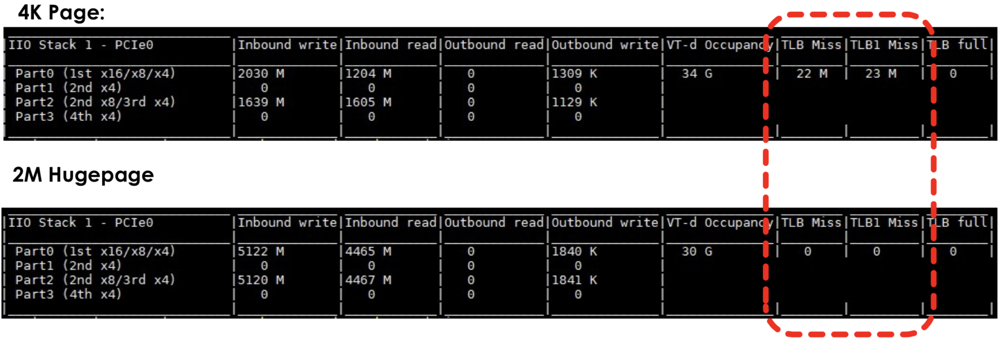
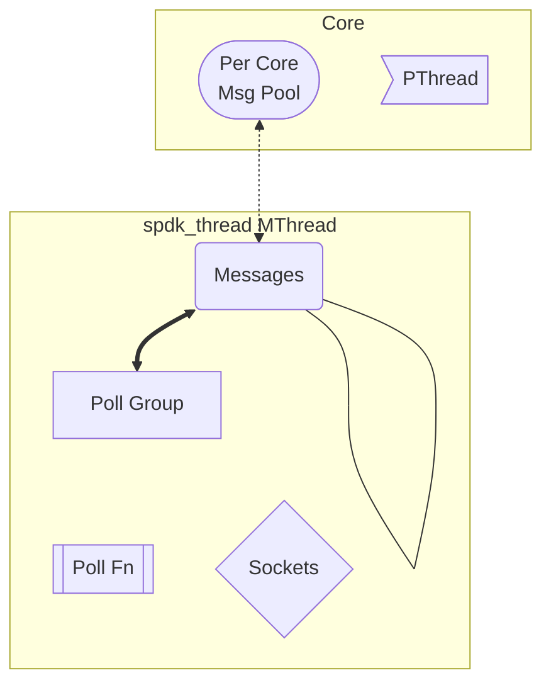
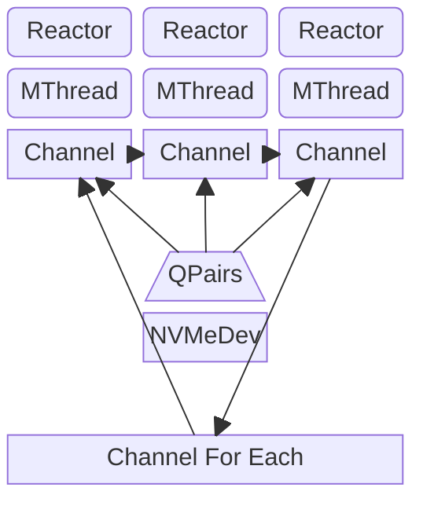
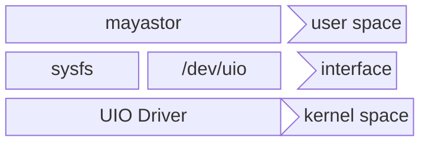

# Mayastor I/O Engine

Here we explain how things work in the mayastor data-plane, particularly how it interfaces with `xPDK`. It discusses the
deep internals of mayastor before going into the implementation of the `Nexus`. \
The goal is not to ensure that everyone fully understands the inner workings of mayastor but for those who would
like to understand it in more detail can use it to get started.

Contributions to these documents are very much welcome, of course, the better we can explain it to ourselves, the better
we can explain it to our users!

Our code, as well as [SPDK], is in a high state of flux. For example, the thread library did not exist when we started
to use [SPDK], so keep this in mind.

## Table of Contents

- [Memory](#memory)
  - [What if we are not using NVMe devices?](#what-if-we-are-not-using-nvme-devices)
- [Lord of the rings](#lord-of-the-rings)
- [Cores](#cores)
- [Reactor](#reactor)
- [Mthreads](#mthreads)
- [IO channels](#io-channels)
- [Passing block devices to mayastor](#passing-block-devices-to-mayastor)
- [Userspace IO](#userspace-io)
- [VF-IO](#vf-io)
- [Acknowledgments](#acknowledgments)

## Memory

The first fundamental understanding that requires some background information at best is how `xPDK` uses/manages memory.
During the start, we allocate memory from huge pages. This is not ideal from a "run everywhere" deployment, but it is
fundamental for achieving high performance for several reasons:

The huge pages result in less [TLB] misses that increase performance significantly. We are not unique in using these. In
fact, the first use of cases for huge pages is found in the databases world. These DBs typically hold a huge amount of
memory, and if you know upfront that you are going to do so, it's going to be more efficient to have 2MB pages than 4KB
pages.

An undocumented feature of huge pages is that they can/are be pinned in memory. This is required if you want to [DMA]
from userspace buffers to HW. Why? Well – if you write code that says write this range of memory (defined in [SGL]) and
the data is moved to a different location by the memory management system, you would get… Garbage. As we deal (not
always) with NVMe userspace drivers, we want [DMA] buffers straight into the device. Without huge pages, this would not
be possible.

During runtime, IO buffers and message queues are pre-allocated during startup. This amount of huge pages is mapped into
a list of regions, and this list of regions is allocated from. IOW, we have within the system our own memory allocator.
All the IO's are, for the most part, pre-allocated, which means that during the actual IO path, no allocations are
happening at all. This can be seen within mayastor when you create a new struct [DMA]Buf; it does not call `Box` or `libc::
malloc()`. The `Drop` implementation does not `free()` the memory rather puts back the buffer on the unused/free list.

The above illustrates what is described previously; 22 million [TLB] misses – vs 0 with 2M pages. This immediately shows
the benefit of using huge pages in terms of performance but remember, and it is not only because of performance but
also – they are required to be able to do [DMA] transfers from memory to the NVMe device.

### What if we are not using NVMe devices?

When we are not using nvme devices, we would, in theory not, not need the huge pages for [DMA] but only for performance.
For cases where the performance requirements are not very high, this would be fine. However, transparent switching
to/from huge pages when needed is a significant amount of work and the work. Setting up the requirements of the huge
page is not hard but inconvenient at best. More so, as k8s does not handle them very well right now.

## Lord of the rings

As with most, if not all, parallel systems shared state is a problem. If you use locks over the shared state, then the
parallelism level will be limited by the "hotness" of the shared state. Fortunately, there are lockless algorithms that
allow for `lockless` approaches that are less expensive than, e.g., a `Mutex`. They are less expensive, not zero, as
they use atomic operations, which are more expensive than non-atomic operations. One such algorithm we use is a `lockless
ring buffer` – the implementation of these buffers is out of scope, but you can find more information here that details
a design for a ring buffer but is not used with `xPDK`.

As mentioned in the memory section, we pre-allocate all memory we need for the IO path during startup. These pre
allocations are put in so-called pools, and you can take and give to/from the pool – without holding locks, as these
pools are implemented using these lockless ring buffers. Needless to say, you don't want to constantly put/take from the
pool because even though atomic, there is an inherent cost to using atomics.



The above picture illustrates the layout where we start from the huge pages, where on top, we have several APIs to
allocate (malloc) from those huge pages. In turn, this API is used to create a pool of pre-allocated objects of
different sizes and are put in the pool. Each pool is identified with a different name.

Using these pools, we can create a smaller subset of lockless pools and assign them per core. Or, phrased differently, a
CPU local cache of elements taken out of the pool via the put/get API. Once taken out of the pool, no other CPU access
those objects, and we do not need to lock them once local to ourselves. The contract here that we need to adhere too
though, is that what is local to us should stay local, IOW we as programmers should ensure that we don't reference an
object between different CPUs.

## Cores

Deep within the `xPDK` library, a bootstrapping code handles the claiming of the huge pages and sets up several threads
of
execution on a per-core basis. The library knows how many cores to use based on a so-called core mask. Let us assume we
have a 4 core CPU, So when we start mayastor with a core mask of 0x1, only the first core (core0) will be
"bootstrapped." If we were to supply 0x3, then core 0 and core 2 will be used. (0x03 == 0011) and so forth. But what
actually happens? If we leave the memory allocations out of it, not all that much!

Using the core mask, we, just like any other application, use OS threads. However, what is different is that in the case
of `mask=0x3`, a thread will be created, and through OS-specific system calls, we tell the OS, this thread may only
execute on CPU2. In mayastor, this is handled within the `core::env.rs` file. Once the thread is started – it will wait
to receive a single function to execute. If that function completes, the created thread will return, just as with any
other thread. No magic here.

With 0x3, it means we need to create one additional thread because when we start the program, we already have at least
one thread. The additional threads we create – are called "remote threads," and in our `core::env.rs` file, we have a
function called `launch_remote()` So all we really do is based on the core mask, create mask-1 threads, and "pin" them
to the core, and execute the launch remote function on each remote core.

The master core will do some other work (i.e., start gRPC) and eventually call a similar function as the
`launch_remote()` – that is, a function that returns when completed.

The question might be: why? Why would you not have the OS decide what core is best to execute on? is that not what an OS
is supposed to do? Typically, yes; however, there are other things to consider (NUMA) but also the fact that if we keep
the thread on the same CPU, we avoid context switch overheads. (i.e., the OS moves us from core N to core M) this, in
turn, reduces [TLB] misses and all the things related to it. In short, its locality principle over again.

For optimal performance, we also need to tell the operating system to pin us to that core and not schedule anything else
on it! This seems like an ideal job for k8s, but unfortunately, it can't, so we have to configure the system to boot
with an option called `isolcpus`. But it's not required; performance would be impaired.

## Reactor

So what is launch local, or remote for that matter, supposed to do? Well, it would need to run in a loop; otherwise, the
program would exit right away. So on each of these cores, we have one data structure called a reactor. The reactor is
the main data structure that we use to keep track of things that we need to do, or, for example, our entry point to shut
down when some hits ctrl+c.

This reactor calls `poll()` in a loop. Poll what? Network connections and yet again, another set of rings. We will go
into more detail later, but for now, it's sufficiently accurate.

The main thread is responsible for creating the reactors. How many? – the same as the number as value as the core mask.
In mayastor, this looks like this:

```rust
self.initialize_eal();

info!(
    "Total number of cores available: {}",
    Cores::count().into_iter().count()
);

// setup our signal handlers
self.install_signal_handlers().unwrap();

// allocate a Reactor per core
Reactors::init();

// launch the remote cores if any. note that during init these have to
// be running as during setup cross call will take place.
Cores::count()
    .into_iter()
    .for_each(|c| Reactors::launch_remote(c).unwrap());
```

The last lines start the remote reactors and, as mentioned, call poll. The main thread will go off and do some other
things but eventually will also join the game and start calling poll. As a result, what we end up with is a set of
threads, which are pinned to a specific core – running in a loop doing nothing else but read/writing to network sockets
and calling functions that are placed within, as mentioned a set of other rings. To understand what rings, we have to
introduce a new concept called "threads." Huh?! We already talked about `threads` did we not? Well, If you think we use
poor naming schemes that can confuse people pretty badly, [SPDK] is no different; [SPDK] has its own notion of threads.
In mayastor, these things are called `mthreads` (Mayastor `threads`).

## Mthreads

To make things confusing, this part is about so-called "threads." But not the ***threads*** you are used to, rather,
[SPDK] threads. These threads are a subset of a msg pool and a subset of all socket connections for a particular core.
To reiterate, we already established that a reactor is per core structure that is our entry point for housekeeping, if
you will. \
If we look into the code, we can see that the reactor has several fields but the most important is the `Vec<Mthread>`
field.

```rust
struct Reactor {
    // the core number we run on
    core: u32,
    // units of work that belong to this reactor
    threads: RefCel<Vec<<MThreads>>>,
    // the current state of the reactor
    state: AtomicCell<ReactorState>,
}

impl Reactor {
    /// poll the mthreads for any incoming work
    fn poll(&self) {
        self.threads.borrow().iter(|t| {
            t.poll();
        });
    }
}
```



The above picture with the including code snippet, hopefully, clears it up somewhat. The reactor structure (per core)
keeps track of a set of `Mthreads`, which are broken down into:

1. messages: These are functions to be called based on packets read or written to/from the network connections or
   explicitly put there by internal functions calls or RPC calls. All these events have the same layout

2. poll_groups: a set of sockets that are polled every time we poll the thread to read/write data to/from the network

3. poll_fn: functions that are called constantly, within a specific interval.

So how many mthreads do we have? Well, as many as you want, but no more than strictly needed. For each reactor, we, for
example, create a thread to handle NVMF connections on that core. We could argue that this mthread is the nvmf thread
for that core. All that core does is handle nvmf work. Similarly, we create one for iSCSI. The idea is that you can
strictly control what core does what by controlling where a thread is started.

This then implies that each core, independently of other cores, can do storage IO which gets us the linear scalability
we need to achieve these low latency values. However, there is one more thing to consider; we now have this
shared-nothing, lockless model such that every core, in effect, can do whatever it wants to do with the device
underneath. But surely, there has to be some synchronisation, right? For example, Lets say we want to "pause" the device
not to accept any IO? We would need to send each core a message to tell each thread on that core that might be doing IO
to that core, and it needs to, well, pause.

You perhaps can imagine that this might not be a single indecent situation and that "pause" is just a single type of
operation that each core would need to do. Other scenarios could be to be able to open the device or close it etc. To
make this a bit easier to deal with, these common patterns are abstracted in so-called io channels. These channels can
be compared to go channels, where you can "send messages on and get called back when all receivers processed the
message.

## IO channels

When you open a file in a programming language of your choice, apart from semantics, for the most part, it will look
roughly as:

```C
void main(void) {
    FILE *my_file;
    if ((my_file = open("path/to/file")) < 0) { /* error */ } else { /* use file */ }
}
```

The variable my_file is called a file descriptor, and within mayastor/spdk, this is no different. When you open want to
open block device, you get back a descriptor. However, unlike the "normal" situation, within mayastor, the descriptor
can not be used. Instead, given a descriptor, you must get an "io channel" to the device the descriptor is referencing.
to do IO directly

```rust
// normal
read(desc, &buf, sizeof(buf));

// mayastor
let channel = desc.get_channel();
read(desc, channel, &buf, sizeof(buf));
```

This is because we need an away to get access to a device within mayastor exclusively. Normally we have the operating
system to handle this for us, but we need to handle this ourselves in userspace. To achieve the parallelism, we the use
a per-core IO channel that we create for that descriptor. Additionally, these channels can be used to "execute something
on each mthread" when we need to change the state of the device/descriptor, like, for example, closing it.

This is done by deep DPDK internals that are not really relevant, but it boils down to the fact that each block device
has a list of channels, which must have a `Mthread` associated with it. (by the design of the whole thing). Using this
information, we can call a function on each thread that has an io channel to our device and have it (for example) close
the channel.



The flow is depicted within the above figure. We call channel_for_each and return when the function has been executed on
each of the cores that have a (reference) to channel the device we wish to operate on. Another use case for this is, for
example, when we do a rebuild operation. We want to tell each core to LOCK a certain range of the device to avoid
writing to it while we are rebuilding it.

## Passing block devices to mayastor

Mayastor has support for several different ways to access or emulate block devices. This can come in handy for several
reasons, but for
**production use cases, we only support devices accessed through [io_uring][io-uring] and `PCI`e devices**.
Originally we planned that you could use all your devices of your choice in any way you want. This creates too much
confusion and a too-wide test matrix. Using this approach, however, we can serve all cases we need except for the direct
remote iSCSI or nvmf targets. The block devices passed to mayastor are used to store replicas.

To access the `PCI` devices from userspace, more setup is required, and we typically don't talk about that too much as
[io_uring][io-uring], for the most part, will be fast enough. Once you are dealing with Optane devices that can do a
million IOPS per device, the need for using userspace `PCI` IO becomes more appealing.

Making use of `PCI` devices in user space is certainly not new. In fact, it has been used within the embedded Linux
space for many years, and it's also a foundation for things like `PCI passthrough` in the virtualization space.

Using devices in mayastor are abstracted using URIs so to use a `/dev/path/to/disk` we can write:
`uring:///dev/path/to/disk`.

## Userspace IO

Userspace I/O is the first way to achieve this model. The kernel module driver attached to the device is unloaded, and
then the UIO driver is attached to the device. Put differently, and one could argue we replace the NVMe driver, which is
loaded by default is replaced by the UIO driver.



## VF-IO

A similar interface to use do userspace IO is [VF-IO][VFIO]. The only difference is that, like with memory, there is an
MMU ([IOMMU]) that ensures that there is some protection, and we don't have a VM (for example) by accident write into
the same `PCI` device and create havoc.

Once the machine is configured to either use vfio or in the `PCI` address to the NVMe device can be used to create a
"pool" using the for example `pci:///000:0067.00`.

<br>

## Acknowledgments

This document was originally written by Jeffry and now converted to GitHub markdown.

[SPDK]: https://spdk.io/

[TLB]: https://wiki.osdev.org/TLB

[DMA]: https://en.wikipedia.org/wiki/Direct_memory_access

[SGL]: https://en.wikipedia.org/wiki/Gather/scatter_(vector_addressing)

[io-uring]: https://man7.org/linux/man-pages/man7/io_uring.7.html

[VFIO]: https://docs.kernel.org/driver-api/vfio.html

[IOMMU]: https://en.wikipedia.org/wiki/Input%E2%80%93output_memory_management_unit
